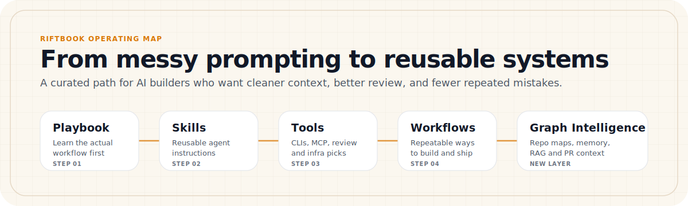

  

<h1 align="center">Riftbook</h1>

  <strong>Awesome Vibe Coding Space</strong>

  A curated field guide for builders who use AI coding agents and want cleaner context, better workflows, and reusable systems.

  
  
  
  

---

  

---

## What Riftbook is

Riftbook is a practical map for AI-assisted builders.

It collects the things that make coding agents more useful in real work: playbooks, skills, tools, prompts, workflows, graph-based context systems, review helpers, and learning paths.

This repo is for people who already know that "just prompt better" is not enough. Good AI-assisted work needs context, rules, review, memory, and repeatable workflows.

## What it helps you avoid

<table>
<tr>
<td width="33%" valign="top">

### Messy agent sessions

When every task starts from zero, the agent forgets how the project works. Riftbook gives you reusable context layers and workflows.

</td>
<td width="33%" valign="top">

### Random tool collecting

Not every AI tool deserves a place in your setup. Riftbook favors tools with clear use cases, commands, prompts, and limits.

</td>
<td width="33%" valign="top">

### Weak code review

AI can produce working code that still breaks flows. Riftbook includes review and graph intelligence tools for blast radius, risk, and test gaps.

</td>
</tr>
</table>

---

## Start here

<table>
<tr>
<td width="25%" valign="top">

### 1. Learn the workflow

Start with the real playbook.

[Open Playbook](./playbook/README.md)

</td>
<td width="25%" valign="top">

### 2. Add agent behavior

Copy reusable skills into your AI coding setup.

[Open Skills](./skills/README.md)

</td>
<td width="25%" valign="top">

### 3. Pick tools carefully

Use tested CLIs, MCP servers, review tools, and agent infrastructure.

[Open Tools](./tools/README.md)

</td>
<td width="25%" valign="top">

### 4. Run repeatable flows

Use workflows for research, design, debugging, graph context, and shipping.

[Open Workflows](./workflows/README.md)

</td>
</tr>
</table>

---

## Choose your route

| If you want to | Start here |
|---|---|
| Learn how to work with coding agents | [The Real Vibe Coding Playbook](./playbook/README.md) |
| Build your first serious agent setup | [Getting Started](./playbook/getting-started/README.md) |
| Find practical agent tools | [Tools](./tools/README.md) |
| Add reusable agent behavior | [Skills](./skills/README.md) |
| Reduce context waste | [Token Efficiency](./skills/token-efficiency/caveman.md) |
| Improve frontend output | [Impeccable](./skills/top-selected/impeccable.md) and [Taste Skill](./skills/hot-skills/taste-skill.md) |
| Review risky changes | [Code Review Graph](./tools/review-intelligence/code-review-graph.md) |
| Add graph-based repo context | [Graphify](./skills/project-intelligence/graphify.md) |
| Explore graph memory and RAG | [Graph Intelligence Stack](./frameworks/graph-intelligence-stack.md) |
| Study foundations | [Learning](./learning/README.md) |

---

## The Real Vibe Coding Playbook

  

A growing field guide for learning how to actually work with AI coding agents.
Built from real workflows, real mistakes, and real lessons, not theory-only advice.

> If you use coding agents but still feel messy, slow, or unsure where to start, begin here.
> Read the featured case study: [How I Use Claude Code and Delegate Team](./playbook/stories/01-how-i-use-claude-code-and-delegate-team.md).

| Section | What is inside |
|---|---|
| [Getting Started](./playbook/getting-started/README.md) | Step zero, project truth, lead agent setup, context files, first moves |
| [Core Workflows](./playbook/core-workflows/README.md) | Planning, multi-agent coordination, debugging, reviewing, and shipping |
| [Mistakes](./playbook/mistakes/README.md) | Common mistakes, personal notes, and things that look smart but hurt |
| [Stories](./playbook/stories/README.md) | Real accounts from actual use: what worked, what failed, what changed |
| [Paths](./playbook/paths/README.md) | Reading order by role: beginner, solo builder, frontend builder, agency operator |

  
  
  

---

## Featured stack

  

The best starting set across design, delegation, review, context, and AI-assisted frontend quality.

| Pick | Category | Why it matters | Card |
|---|---|---|---|
| **Impeccable** | AI Frontend Design | Gives coding agents practical UI judgment for audit, critique, polish, layout, typography, hardening, and live iteration |  |
| **Delegate Team** | Agent Delegation Runtime | Lets Claude Code delegate focused tasks to Codex, MiniMax, Gemini, OpenCode, VertexCoder, or team-style workflows while keeping review centralized |  |
| **React Doctor** | React Quality Gate | Catches React issues across state, effects, performance, architecture, security, and accessibility after the agent builds the UI |  |
| **Graphify** | Project Intelligence | Turns a repo into a queryable graph so agents understand structure before editing |  |
| **Code Review Graph** | Review Intelligence | Reviews PRs and local changes through blast radius, affected flows, test gaps, and targeted context |  |
| **Taste Skill** | Frontend Design | Helps agents avoid generic frontend output and make better visual decisions |  |

---

## New: Graph Intelligence layer

Graph tools are powerful only when they are used for the right job. Riftbook now separates four graph layers clearly.

| Layer | Tool | Use it for | Card |
|---|---|---|---|
| Project map | **Graphify** | Understanding a repo or mixed project folder before editing | [Open](./skills/project-intelligence/graphify.md) |
| Corpus reasoning | **Microsoft GraphRAG** | Reasoning over private documents, reports, transcripts, policies, and research notes | [Open](./frameworks/rag/graphrag.md) |
| Temporal memory | **Graphiti** | Agents that need evolving memory, provenance, current facts, and historical facts | [Open](./frameworks/agent-memory/graphiti.md) |
| Review blast radius | **Code Review Graph** | Reviewing PRs and uncommitted changes through affected files, symbols, flows, and tests | [Open](./tools/review-intelligence/code-review-graph.md) |

Start with the full map:

[Open Graph Intelligence Stack](./frameworks/graph-intelligence-stack.md)

Run it as a workflow:

[Open Graph Intelligence Workflow](./workflows/graph-intelligence-workflow.md)

---

## Browse by category

| Category | What you will find | Link |
|---|---|---|
| **Playbook** | Field guide for working with AI coding agents: lessons, mistakes, stories, and paths | [Open](./playbook/README.md) |
| **Skills** | Reusable agent instructions, behaviors, and custom prompt logic layers | [Open](./skills/README.md) |
| **Tools** | IDE extensions, MCP servers, terminal utilities, review tools, and agent infrastructure | [Open](./tools/README.md) |
| **Prompts** | Curated prompts for coding, design, writing, research, and automation | [Open](./prompts/README.md) |
| **Workflows** | Step-by-step ways to debug, research, design, review, and ship | [Open](./workflows/README.md) |
| **Frameworks** | Architecture-level systems for retrieval, reasoning, context, and memory | [Open](./frameworks/README.md) |
| **Guides** | Setup playbooks, best practices, and configuration guides | [Open](./guides/README.md) |
| **Indexes** | Discovery hubs for AI-assisted coding resources | [Open](./indexes/README.md) |
| **Learning** | Courses, tutorials, and study paths for agentic systems | [Open](./learning/README.md) |
| **Templates** | Standard markdown patterns for prompts, skills, tools, and workflows | [Open](./templates/README.md) |
| **Cheat Sheets** | Dense references and command lookups | [Open](./cheat-sheets/README.md) |
| **Execution Playbooks** | End-to-end handbooks for product launch and build methods | [Open](./playbooks/README.md) |
| **Resources** | External libraries, papers, and reference documentation | [Open](./resources/README.md) |
| **Examples** | Real prompt examples, case studies, and before-after comparisons | [Open](./examples/README.md) |
| **Ideas** | Backlog of product, automation, and research concepts for builders | [Open](./ideas/README.md) |

---

## All resources

The complete index of curated cards in this repo.

### Token Efficiency

| Resource | Category | Why it matters | Card |
|---|---|---|---|
| **Caveman** | Token Efficiency | Cuts verbose agent output and makes long coding sessions easier to scan |  |
| **RTK** | Token Efficiency | Compresses terminal output before it enters the AI context window, reducing CLI noise during long coding sessions |  |

### Project Intelligence

| Resource | Category | Why it matters | Card |
|---|---|---|---|
| **Graphify** | Project Intelligence | Turns a repo into a queryable graph so agents understand structure before editing |  |
| **Graph Intelligence Stack** | Graph Systems | Shows when to use Graphify, GraphRAG, Graphiti, and Code Review Graph |  |
| **Graph Intelligence Workflow** | Workflow | Gives agents a step-by-step process for graph-informed coding, review, RAG, and memory design |  |

### Frontend Design

| Resource | Category | Why it matters | Card |
|---|---|---|---|
| **Impeccable** | AI Frontend Design | Gives AI coding agents practical design judgment for audit, critique, polish, layout, typography, hardening, and live iteration |  |
| **Taste Skill** | Frontend Design | Gives AI coding agents stronger UI taste and helps avoid generic frontend output |  |

### Use Case Skills

| Resource | Category | Why it matters | Card |
|---|---|---|---|
| **Last30Days** | Recent-signal research | Searches recent social, developer, market, GitHub, and web signals before meetings, research, validation, or comparisons |  |

### Review Intelligence

| Resource | Category | Why it matters | Card |
|---|---|---|---|
| **Code Review Graph** | PR Review Infrastructure | Builds a local graph of the repo so AI agents can review changes through blast radius, risk, affected flows, and targeted context |  |
| **Open Code Review** | AI Review Automation | Runs structured AI code reviews on diffs, commits, branches, or full-file scans with line-level comments and configurable review rules |  |
| **reviewdog** | CI Review Bridge | Turns linter and static-analysis output into PR comments, checks, and annotations so vibe-coded changes get readable feedback inside review |  |

### Agent Infrastructure

| Resource | Category | Why it matters | Card |
|---|---|---|---|
| **Serena** | MCP Semantic Coding Toolkit | Gives agents IDE-like symbol navigation, semantic editing, refactoring, and project memory |  |
| **Delegate Team** | Agent Delegation Runtime | Lets Claude Code delegate focused tasks to Codex, MiniMax, Gemini, OpenCode, VertexCoder, or team workflows while keeping review centralized |  |

### React Quality Gates

| Resource | Category | Why it matters | Card |
|---|---|---|---|
| **React Doctor** | React Quality Audit | Catches React issues across state, effects, performance, architecture, security, and accessibility after the agent builds the UI |  |

### Core Frameworks

| Resource | Category | Why it matters | Card |
|---|---|---|---|
| **Microsoft GraphRAG** | RAG Infrastructure | Builds graph-based retrieval pipelines for reasoning over private or complex document collections |  |
| **Graphiti** | Agent Memory | Builds temporal context graphs for agents that need changing facts, provenance, and session-to-session memory |  |

### Hot Indexes

| Resource | Category | Why it matters | Card |
|---|---|---|---|
| **Awesome Claude Code** | Claude Code Ecosystem | Helps discover Claude Code skills, hooks, agents, commands, plugins, and workflow resources |  |

### Best Practice Guides

| Resource | Category | Why it matters | Card |
|---|---|---|---|
| **Claude Code Best Practice** | Claude Code | Helps move from casual prompting to structured Claude Code workflows using commands, agents, skills, hooks, MCP, and memory |  |

### Learning Paths

| Resource | Category | Why it matters | Card |
|---|---|---|---|
| **AI Agents for Beginners** | AI Agents | A Microsoft learning path for understanding how agents work before building with them |  |

---

## How to use this repo

1. **Copy and adapt**: Do not just read. Copy prompts, templates, and skill files into your workspace configuration.
2. **Install selectively**: Add tools only when they solve a specific problem in your workflow.
3. **Run workflows**: Use the workflow docs before debugging, refactoring, reviewing, or shipping.
4. **Keep generated files controlled**: Graph outputs, indexes, and local tool artifacts should not be committed unless the repo policy says so.
5. **Verify important claims**: Treat graph output and AI summaries as guidance. Check source files before risky edits.

---

## Quality rules

Every item added to Riftbook should follow this schema:

1. **Name**: Clear and descriptive name.
2. **Category**: Exact folder and file classification.
3. **What it is**: Concise description of what the item does.
4. **Why it matters**: Practical value in real AI-assisted work.
5. **When to use**: The precise workflow phase or problem it addresses.
6. **How to use**: Step-by-step instructions.
7. **Commands and prompts**: Executable code blocks and agent instructions.
8. **Good fit and not a good fit**: Clear target use cases and limits.
9. **Notes and limitations**: Warnings, gotchas, and safety checks.
10. **Official link**: Verified link to the target resource.

### What is not included

To keep the repo useful, Riftbook avoids:

- Untested links or products
- Hype-only AI tools with no practical coding value
- Empty prompt lists like "Act as a developer"
- Broad advice without explicit use cases
- Outdated, broken, or unmaintained repositories

---

## Sponsors

Riftbook is supported by products built for real AI-assisted workflows.

<table>
  <tr>
    <td width="100%">
      <h3>
        <a href="https://app.prepilot-system-agency.space/">PrePilot Agency Suite</a>
      </h3>
      

        Talk to AI like a teammate. A structured agency workflow layer for planning, strategy, and execution with AI.
      

      

        
      

    </td>
  </tr>
</table>

Want to support Riftbook? See [SPONSORS.md](./SPONSORS.md).

---

## Contribute

Read [CONTRIBUTING.md](./CONTRIBUTING.md) for formatting rules, templates, and pull request guidance.

If Riftbook saves you time, helps you find a useful tool, or gives you a better workflow:

- Star the repo
- Share it with another AI-assisted builder
- Open a PR with a workflow-tested card

Riftbook gets better when builders contribute tools they have actually used.

---

## Special thanks

Thanks to the creators, developers, and maintainers of the repositories featured in Riftbook.

| Creator | Featured project |
|---|---|
| [@pbakaus](https://github.com/pbakaus) | [Impeccable](https://github.com/pbakaus/impeccable) |
| [@JuliusBrussee](https://github.com/JuliusBrussee) | [Caveman](https://github.com/JuliusBrussee/caveman) |
| [@rtk-ai](https://github.com/rtk-ai) | [RTK](https://github.com/rtk-ai/rtk) |
| [@Graphify-Labs](https://github.com/Graphify-Labs) | [Graphify](https://github.com/Graphify-Labs/graphify) |
| [@getzep](https://github.com/getzep) | [Graphiti](https://github.com/getzep/graphiti) |
| [@Leonxlnx](https://github.com/Leonxlnx) | [Taste Skill](https://github.com/Leonxlnx/taste-skill) |
| [@mvanhorn](https://github.com/mvanhorn) | [Last30Days](https://github.com/mvanhorn/last30days-skill) |
| [@tirth8205](https://github.com/tirth8205) | [Code Review Graph](https://github.com/tirth8205/code-review-graph) |
| [@alibaba](https://github.com/alibaba) | [Open Code Review](https://github.com/alibaba/open-code-review) |
| [@reviewdog](https://github.com/reviewdog) | [reviewdog](https://github.com/reviewdog/reviewdog) |
| [@oraios](https://github.com/oraios) | [Serena](https://github.com/oraios/serena) |
| [@millionco](https://github.com/millionco) | [React Doctor](https://github.com/millionco/react-doctor) |
| [@microsoft](https://github.com/microsoft) | [GraphRAG](https://github.com/microsoft/graphrag) and [AI Agents for Beginners](https://github.com/microsoft/ai-agents-for-beginners) |
| [@hesreallyhim](https://github.com/hesreallyhim) | [Awesome Claude Code](https://github.com/hesreallyhim/awesome-claude-code) |
| [@shanraisshan](https://github.com/shanraisshan) | [Claude Code Best Practice](https://github.com/shanraisshan/claude-code-best-practice) |
| [@imMamdouhaboammar](https://github.com/imMamdouhaboammar) | [Delegate Team](https://github.com/imMamdouhaboammar/delegate-team) |
| [@mamdouhaboammar](https://github.com/mamdouhaboammar) | [Chrome DevTools MCP](https://github.com/mamdouhaboammar/chrome-devtools-mcp) |
| [@obra](https://github.com/obra) | [Superpowers](https://github.com/obra/superpowers) |

---

## Topics and keywords

`vibe-coding` · `awesome-vibe-coding` · `claude-code` · `ai-agents` · `coding-agents` · `awesome-list` · `developer-tools` · `mcp-servers` · `metagpt` · `openai-codex` · `vertex-ai` · `prompt-engineering` · `agentic-workflows` · `knowledge-graph` · `graphrag` · `agent-memory` · `riftbook`
