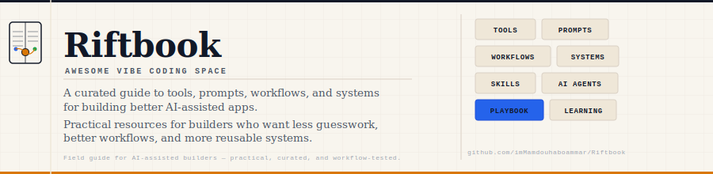
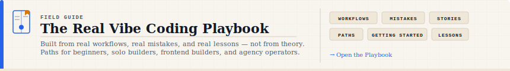

  

<h1 align="center">Riftbook</h1>

  <strong>Awesome Vibe Coding Space</strong>

  A curated guide to tools, prompts, workflows, and systems for building better AI-assisted apps.

  Practical resources for builders who want less guesswork, better workflows, and more reusable systems.

  
  
  

---

## Start Here

New here? Three paths in. Pick the one that fits:

<table>
<tr>
<td align="center" width="33%">

**[Start the Playbook](./playbook/README.md)**

Real workflows, real mistakes, real lessons.
Paths for beginners, solo builders, frontend builders, and agency operators.

</td>
<td align="center" width="33%">

**[Browse Tools](./tools/README.md)**

IDE extensions, MCP servers, CLI utilities,
and agent infrastructure — curated and tested.

</td>
<td align="center" width="33%">

**[Explore Skills](./skills/README.md)**

Reusable agent behaviors and custom
prompt logic layers you can copy directly.

</td>
</tr>
</table>

---

## Choose Your Route

| If you want to… | Start here |
|---|---|
| Learn how to work with coding agents | [The Real Vibe Coding Playbook](./playbook/README.md) |
| Find practical agent tools | [Tools](./tools/README.md) |
| Add reusable agent behavior | [Skills](./skills/README.md) |
| Build safer workflows | [Workflows](./workflows/README.md) |
| Study foundations | [Learning](./learning/README.md) |

---

## Sponsors

Riftbook is supported by products built for real AI-assisted workflows.

<table>
  <tr>
    <td width="100%">
      <h3>
        <a href="https://app.prepilot-system-agency.space/">PrePilot Agency Suite</a>
      </h3>
      

        Talk to AI like a teammate. A structured agency workflow layer for planning, strategy, and execution with AI.
      

      

        
      

    </td>
  </tr>
</table>

Want to support Riftbook? See [SPONSORS.md](./SPONSORS.md).

---

## The Real Vibe Coding Playbook

  

A growing field guide for learning how to actually work with AI coding agents.
Built from real workflows, real mistakes, and real lessons — not from theory.

> If you are using coding agents and still feel messy, slow, or unsure where to start, the playbook is for you.
> Read our featured case study: [How I Use Claude Code and Delegate Team](./playbook/stories/01-how-i-use-claude-code-and-delegate-team.md).

| Section | What is inside |
|---|---|
| 🚀 [Getting Started](./playbook/getting-started/README.md) | How to begin the right way — lead agent, rules, context files, first steps |
| ⚙️ [Core Workflows](./playbook/core-workflows/README.md) | Planning, multi-agent coordination, debugging, reviewing, and shipping |
| ❌ [Mistakes](./playbook/mistakes/README.md) | Common mistakes, personal confessions, and things that look smart but hurt |
| 📖 [Stories](./playbook/stories/README.md) | Real accounts from actual use — what worked, what didn't, what changed |
| 🗺️ [Paths](./playbook/paths/README.md) | Structured reading order by role: beginner, solo builder, frontend, agency |

  
  
  

---

## Featured Picks

  

The most useful resources to start with, across design, delegation, review, and intelligence.

| Pick | Category | Why it matters | Card |
|---|---|---|---|
| **Impeccable** | AI Frontend Design | Gives AI coding agents a practical design language with commands for audit, critique, polish, layout, typography, hardening, and live iteration |  |
| **Delegate Team** | Agent Delegation Runtime | Lets Claude Code delegate focused tasks to Codex, MiniMax, Gemini, OpenCode, VertexCoder, or team workflows while keeping review and approval centralized |  |
| **React Doctor** | React Quality Gate | Catches React issues across state, effects, performance, architecture, security, and accessibility after the agent builds the UI |  |
| **Graphify** | Project Intelligence | Turns a repo into a queryable graph so agents understand structure before editing |  |
| **Taste Skill** | Frontend Design | Gives AI coding agents stronger UI taste and helps avoid generic frontend output |  |

---

## Browse by Category

| Category | What you'll find | Link |
|---|---|---|
| **The Real Vibe Coding Playbook** | Field guide for working with AI coding agents — lessons, mistakes, stories, and paths | [Open](./playbook/README.md) |
| **Skills** | Reusable agent instructions, behaviors, and custom prompt logic layers | [Open](./skills/README.md) |
| **Tools** | A curated index of IDE extensions, MCP servers, and terminal utilities | [Open](./tools/README.md) |
| **Prompts** | Curated, tested prompts for coding, design, writing, research, and automation | [Open](./prompts/README.md) |
| **Workflows** | Step-by-step blueprints for debugging, researching, designing, and shipping | [Open](./workflows/README.md) |
| **Frameworks** | Architecture-level projects and technical frameworks for building serious AI-assisted applications | [Open](./frameworks/README.md) |
| **Guides** | Setup playbooks, best practices, and configurations (e.g. Claude Code) | [Open](./guides/README.md) |
| **Indexes** | Curated indexes and discovery hubs for finding AI-assisted coding resources | [Open](./indexes/README.md) |
| **Learning** | Structured courses, tutorials, and study paths for agentic systems | [Open](./learning/README.md) |
| **Templates** | Standardized markdown patterns for prompts, skills, tools, and workflows | [Open](./templates/README.md) |
| **Cheat Sheets** | High-density references and command lookups for coding and git | [Open](./cheat-sheets/README.md) |
| **Execution Playbooks** | End-to-end handbooks detailing product launch and build methodologies | [Open](./playbooks/README.md) |
| **Resources** | External libraries, academic papers, and reference documentation | [Open](./resources/README.md) |
| **Examples** | Real-world prompt examples, case studies, and before/after comparisons | [Open](./examples/README.md) |
| **Ideas** | Backlog of product, automation, and research concepts for builders | [Open](./ideas/README.md) |

---

## All Resources

The complete index of curated cards in this repo.

### Token Efficiency

| Resource | Category | Why it matters | Card |
|---|---|---|---|
| **Caveman** | Token Efficiency | Cuts verbose agent output and makes long coding sessions easier to scan |  |
| **RTK** | Token Efficiency | Compresses terminal output before it enters the AI context window, reducing CLI noise during long coding sessions |  |

### Project Intelligence

| Resource | Category | Why it matters | Card |
|---|---|---|---|
| **Graphify** | Project Intelligence | Turns a repo into a queryable graph so agents understand structure before editing |  |

### Frontend Design

| Resource | Category | Why it matters | Card |
|---|---|---|---|
| **Impeccable** | AI Frontend Design | Gives AI coding agents a practical design language with commands for audit, critique, polish, layout, typography, hardening, and live iteration |  |
| **Taste Skill** | Frontend Design | Gives AI coding agents stronger UI taste and helps avoid generic frontend output |  |

### Use Case Skills

| Resource | Category | Why it matters | Card |
|---|---|---|---|
| **Last30Days** | Recent-signal research | Searches recent social, developer, market, GitHub, and web signals before meetings, research, validation, or comparisons |  |

### Review Intelligence

| Resource | Category | Why it matters | Card |
|---|---|---|---|
| **Code Review Graph** | PR Review Infrastructure | Builds a local graph of the repo so AI agents can review changes through blast radius, risk, affected flows, and targeted context |  |
| **Open Code Review** | AI Review Automation | Runs structured AI code reviews on diffs, commits, branches, or full-file scans with line-level comments and configurable review rules |  |
| **reviewdog** | CI Review Bridge | Turns linter and static-analysis output into PR comments, checks, and annotations so vibe-coded changes get readable feedback inside review |  |

### Agent Infrastructure

| Resource | Category | Why it matters | Card |
|---|---|---|---|
| **Serena** | MCP Semantic Coding Toolkit | Gives agents IDE-like symbol navigation, semantic editing, refactoring, and project memory |  |
| **Delegate Team** | Agent Delegation Runtime | Lets Claude Code delegate focused tasks to Codex, MiniMax, Gemini, OpenCode, VertexCoder, or team workflows while keeping review and approval centralized |  |

### React Quality Gates

| Resource | Category | Why it matters | Card |
|---|---|---|---|
| **React Doctor** | React Quality Audit | Catches React issues across state, effects, performance, architecture, security, and accessibility after the agent builds the UI |  |

### Core Frameworks

| Resource | Category | Why it matters | Card |
|---|---|---|---|
| **Microsoft GraphRAG** | RAG Infrastructure | Builds graph-based retrieval pipelines for reasoning over private or complex document collections |  |

### Hot Indexes

| Resource | Category | Why it matters | Card |
|---|---|---|---|
| **Awesome Claude Code** | Claude Code Ecosystem | Helps discover Claude Code skills, hooks, agents, commands, plugins, and workflow resources |  |

### Best Practice Guides

| Resource | Category | Why it matters | Card |
|---|---|---|---|
| **Claude Code Best Practice** | Claude Code | Helps move from casual prompting to structured Claude Code workflows using commands, agents, skills, hooks, MCP, and memory |  |

### Learning Paths

| Resource | Category | Why it matters | Card |
|---|---|---|---|
| **AI Agents for Beginners** | AI Agents | A Microsoft learning path for understanding how agents work before building with them |  |

---

## How to Use This Repo

1. **Copy & Adapt** — Don't just read. Copy prompts, templates, and skill files directly into your workspace configuration (e.g. your `.claudecoderc` or system instructions).
2. **Integrate Tools** — Adopt the developer utilities listed in the [Tool Stack](./tools/README.md) to reduce context noise and optimize speed.
3. **Execute Blueprints** — Follow step-by-step [Workflows](./workflows/README.md) for testing, debugging, and shipping code.

---

## Quality Rules

Every item added to Riftbook must follow a strict schema:

1. **Name** — Clear and descriptive name.
2. **Category** — Exact folder/file classification.
3. **What it is** — Concise description of what the item does.
4. **Why it matters** — Explanation of its value and significance.
5. **When to use** — The precise workflow phase or issue this addresses.
6. **How to use** — Practical step-by-step instructions.
7. **Commands / Prompts** — Executable code blocks and agent instructions.
8. **Good fit for / Not a good fit for** — Demarcation of target use cases.
9. **Notes & Limitations** — Constraining parameters, warnings, or gotchas.
10. **Official Link** — Verified link to the target resource.

### What is Not Included

To maintain a high signal-to-noise ratio, this repository excludes:

- Untested links or products
- Hype-only AI tools with no practical coding value
- Empty or generic prompt lists (e.g., "Act as a developer")
- Broad advice lacking explicit use cases
- Outdated, broken, or unmaintained repositories

---

## Contribute

Read [CONTRIBUTING.md](./CONTRIBUTING.md) for rules on how to format additions, follow templates, and submit pull requests.

If Riftbook saves you time, helps you find a useful tool, or gives you a better workflow:

- ⭐ Star the repo
- 🔗 Share it with another AI-assisted builder
- 🤝 Open a PR with a workflow-tested card

Riftbook gets better when builders contribute tools they have actually used.

---

## Special Thanks

A huge thank you to the creators, developers, and maintainers of the repositories featured in Riftbook. Your open-source work is the foundation of the modern vibe coding and AI agent ecosystem.

| Creator | Featured Project |
|---|---|
| [@pbakaus](https://github.com/pbakaus) | [Impeccable](https://github.com/pbakaus/impeccable) (AI Frontend Design Language) |
| [@JuliusBrussee](https://github.com/JuliusBrussee) | [Caveman](https://github.com/JuliusBrussee/caveman) (Token Efficiency Formatter) |
| [@rtk-ai](https://github.com/rtk-ai) | [RTK](https://github.com/rtk-ai/rtk) (CLI Output Token Compressor) |
| [@safishamsi](https://github.com/safishamsi) | [Graphify](https://github.com/safishamsi/graphify) (Project Knowledge Graph builder) |
| [@Leonxlnx](https://github.com/Leonxlnx) | [Taste Skill](https://github.com/Leonxlnx/taste-skill) (Frontend UI/UX design taste skill) |
| [@mvanhorn](https://github.com/mvanhorn) | [Last30Days](https://github.com/mvanhorn/last30days-skill) (Recent-signal web search skill) |
| [@tirth8205](https://github.com/tirth8205) | [Code Review Graph](https://github.com/tirth8205/code-review-graph) (PR Context & Blast Radius visualizer) |
| [@alibaba](https://github.com/alibaba) | [Open Code Review](https://github.com/alibaba/open-code-review) (AI-powered automated code reviews) |
| [@reviewdog](https://github.com/reviewdog) | [reviewdog](https://github.com/reviewdog/reviewdog) (Linter bridge for pull request reviews) |
| [@oraios](https://github.com/oraios) | [Serena](https://github.com/oraios/serena) (IDE-like MCP Semantic Coding Toolkit) |
| [@millionco](https://github.com/millionco) | [React Doctor](https://github.com/millionco/react-doctor) (React code auditing & quality gates) |
| [@microsoft](https://github.com/microsoft) | [GraphRAG](https://github.com/microsoft/graphrag) & [AI Agents for Beginners](https://github.com/microsoft/ai-agents-for-beginners) |
| [@hesreallyhim](https://github.com/hesreallyhim) | [Awesome Claude Code](https://github.com/hesreallyhim/awesome-claude-code) index |
| [@shanraisshan](https://github.com/shanraisshan) | [Claude Code Best Practice](https://github.com/shanraisshan/claude-code-best-practice) |
| [@imMamdouhaboammar](https://github.com/imMamdouhaboammar) | [Delegate Team](https://github.com/imMamdouhaboammar/delegate-team) (Agent Delegation Runtime) |
| [@mamdouhaboammar](https://github.com/mamdouhaboammar) | [Chrome DevTools MCP](https://github.com/mamdouhaboammar/chrome-devtools-mcp) |
| [@obra](https://github.com/obra) | [Superpowers](https://github.com/obra/superpowers) (Structured agent workflows) |

---

## Topics & Keywords

`vibe-coding` · `awesome-vibe-coding` · `claude-code` · `ai-agents` · `coding-agents` · `awesome-list` · `developer-tools` · `mcp-servers` · `metagpt` · `openai-codex` · `vertex-ai` · `prompt-engineering` · `agentic-workflows` · `riftbook`
