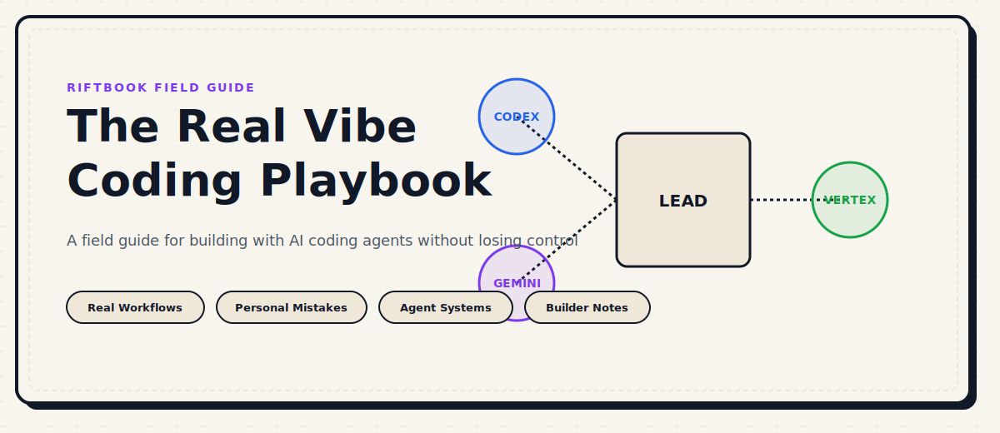

  

<h1 align="center">The Real Vibe Coding Playbook</h1>

  <strong>A growing field guide for builders working with AI coding agents.</strong>

  This is the playbook I wish I had when I started building with coding agents. 
  Not a list of shiny tools. Not generic advice. 
  Just the workflows, lessons, mistakes, and patterns that actually helped.

  
  
  

---

## Why This Playbook Exists

If you are using coding agents and still feel messy, slow, or unsure where to start — this playbook is for you.

It is not a list of tools. It is not a course. It does not pretend to be neutral.

It is built from **real use**, **real mistakes**, and **real fixes** — by someone who actually builds with AI coding agents, figures out what works, gets stuck, recovers, and keeps going.

The goal is simple: help you build with more clarity, fewer wrong turns, and better judgment.

> This playbook grows over time. Every lesson here came from actually using these tools, not from reading about them.

---

## Start Here

If you are new to working with AI coding agents, read these first — in order:

| # | Lesson | Why it matters |
|---|---|---|
| 0 | [Step 0: Build the Project Truth](./getting-started/00-step-zero-build-the-project-truth.md) | Most people start wrong by writing code immediately. Build the truth first. |
| 1 | [From MVP Idea to Agent-Ready Spec](./getting-started/01-turn-your-mvp-idea-into-an-agent-ready-spec.md) | Shape concept with AI client, then hand off to coding agent. |
| 2 | [Choose Your Lead Agent](./getting-started/02-choose-your-lead-agent.md) | The most important decision most builders skip. |
| 3 | [Build Your Default Stack](./getting-started/03-build-your-default-stack.md) | Stop picking tools every time. Build a repeatable setup. |
| 4 | [Set Rules Before You Build](./getting-started/04-set-rules-before-you-build.md) | Rules are not optional. They are what makes agents predictable. |

---

## Sections

### 🚀 Getting Started
The entry point. Start here before anything else.

> 5 foundational lessons on how to begin the right way.

[→ Open Getting Started](./getting-started/README.md)

---

### ⚙️ Core Workflows
The real day-to-day routines of working with coding agents.

> Planning, multi-agent coordination, debugging, reviewing, and shipping.

[→ Open Core Workflows](./core-workflows/README.md)

---

### ❌ Mistakes
The most honest section in the playbook.

> Common mistakes, personal mistakes, and things that look smart but waste time.

[→ Open Mistakes](./mistakes/README.md)

---

### 📖 Stories
Real examples are easier to remember than abstract advice.

> Short, honest accounts of real use — what worked, what didn't, and what I would do differently.

[→ Open Stories](./stories/README.md)

---

### 🗺️ Paths
Not everyone starts from the same place. Find yours.

> Structured reading order based on your role, experience, and goal.

[→ Open Paths](./paths/README.md)

---

## Learning Paths

| Path | Best for | Start |
|---|---|---|
| [Beginner Path](./paths/beginner-path.md) | First time using a coding agent | [Start →](./paths/beginner-path.md) |
| [Solo Builder Path](./paths/solo-builder-path.md) | Building products alone with AI | [Start →](./paths/solo-builder-path.md) |
| [Frontend Path](./paths/frontend-path.md) | UI-first builders | [Start →](./paths/frontend-path.md) |
| [Product-Minded Path](./paths/product-minded-path.md) | Product thinkers who code | [Start →](./paths/product-minded-path.md) |
| [Agency Operator Path](./paths/agency-operator-path.md) | Running multiple clients or projects | [Start →](./paths/agency-operator-path.md) |

---

## Featured Lessons

> Lessons with the most signal for most builders.

| Lesson | Section | Signal |
|---|---|---|
| [Step 0: Build the Project Truth](./getting-started/00-step-zero-build-the-project-truth.md) | Getting Started | Core entry point for everything |
| [From MVP Idea to Agent-Ready Spec](./getting-started/01-turn-your-mvp-idea-into-an-agent-ready-spec.md) | Getting Started | Shape concept with AI client, then hand off to coding agent |
| [Choose Your Lead Agent](./getting-started/02-choose-your-lead-agent.md) | Getting Started | The decision most people skip |
| [Common Vibe Coding Mistakes](./mistakes/01-common-vibe-coding-mistakes.md) | Mistakes | What trips up most builders |
| [Planning the Build](./core-workflows/01-planning-the-build.md) | Core Workflows | Saves hours every project |
| [Debugging with Agents](./core-workflows/03-debugging-with-agents.md) | Core Workflows | Most underrated skill |

---

## Badge Legend

Badges appear inside lessons to signal what kind of content you are reading.

### Lesson Signal Badges

| Badge | Meaning |
|---|---|
|  | A small practical shortcut that pays off quickly |
|  | Something builders often damage without noticing |
|  | A serious pattern that can waste time or break trust |
|  | A real mistake from direct experience |
|  | A real example or short account of something that happened |
|  | A practical exercise to apply the lesson immediately |
|  | Something that gives you visible results fast |
|  | A recommended setup or configuration to use as a starting point |
|  | A warning sign that something is wrong or about to go wrong |
|  | A prompt, command, or snippet ready to use directly |
|  | A smart way to use a coding agent inside a workflow |
|  | A final check before moving on or shipping something |
|  | A framework or concept that changes how you think about something |
|  | The first action to take in a given situation |
|  | Signals that it is time to change agents, tools, or approach |

---

## What I Got Wrong

This block will grow over time. These are things I learned the hard way — not from reading, but from building.

- **Starting without a lead agent.** I used to open multiple agents and run them in parallel with no structure. Nothing finished properly.
- **Not writing rules before building.** Agents make the same decisions differently every time unless you give them rules. I learned this after the third rewrite.
- **Treating planning as optional.** I skipped planning because it felt slow. Every time I did this, the project took twice as long.
- **Switching agents mid-context too often.** The new agent does not know what the first one was thinking. You always pay a context tax.
- **Trusting agent output without review.** It looks correct most of the time. It is not correct most of the time.

> This section grows with every new lesson added to the playbook.

---

## What This Playbook Is Not

- It is not a list of AI tools to install
- It is not a motivational productivity guide
- It is not fake-positive builder culture content
- It is not a course with checkboxes and completion certificates

It is a field guide. Read it like one.

---

## How the Playbook Grows

New lessons get added from real use. If something works reliably, it earns a lesson. If something fails consistently, it earns a mistake entry. Stories come from actual projects.

The playbook is never finished. That is the point.

---

*Part of [Riftbook](../README.md) — Awesome Vibe Coding Space*
