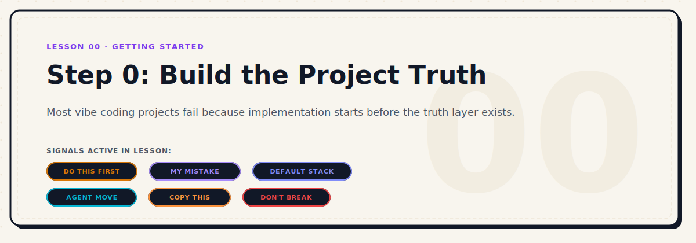

<p align="center">
  
</p>

# Step 0: Build the Project Truth Before You Build the Project

| Level | Duration | Path | Prerequisites | Tools Mentioned |
|---|---|---|---|---|
| Beginner | 6 mins | Start Here | None | Vibe Driven Dev (VDD) |

### Active Signals in this Lesson
-  ·  ·  ·  ·  · 

---

## The Challenge

### The Trap I Kept Falling Into
I used to start projects by telling the coding agent: *"Build me a dashboard that does X."* 

It felt amazing. The agent would immediately select a stack, generate folder structures, install dependencies, and start churning out files. I felt like a wizard. 

But within an hour, reality would hit. We would hit a point where we had to rewrite half the codebase because:
- We never decided whether we needed server-side rendering or a simple static site.
- The agent chose a state management library I didn't want.
- Hidden requirements and assumptions started surfacing, causing architectural conflicts.
- The agent was making design decisions that drifted from my style preferences.

The project got bloated, messy, and hard to manage. I realized we were building on sand.


> **MY MISTAKE:** I kept starting implementation before establishing a project truth layer. The agent was forced to guess my preferences, stack choices, and non-negotiables.

### Why Stack Confusion is Not Really a Stack Problem
When builders ask: *"Should I use Next.js or Vite?"* they think they are debating technical merits. 

But the real issue is that they are asking the agent to make a choice blindly. If you do not choose the stack, the agent chooses it for you. And the agent does not choose based on your product's requirements or long-term plan. 

Instead, the agent chooses based on:
1. Its training habits (most common/boilerplate examples in its training data).
2. What is easiest to generate in a single text block.
3. What sounds modern or trendy, regardless of suitability.

That is not strategy. That is drift.

---

## Core Strategy

### What Step 0 Actually Means
Before writing a single line of code or installing a dependency, you must slow the agent down to speed it up. 

**Step 0 is the Pre-Execution Layer.** It is the process of defining the project's source of truth before code implementation starts.


> **DO THIS FIRST:** Never let an agent create project scaffolding or run initialization commands (`npm create`, `npx create-next-app`, etc.) until it has written and documented the project's core truth files.

### The Project Truth Layer
At a minimum, your repository must contain these files before any execution begins:

1. **`PRODUCT.md`**: The core definition of what you are building, who it is for, what the first version includes, and what it explicitly excludes.
2. **`DESIGN.md`**: Visual guidelines, colors, component design tokens, and layout principles (e.g., typography, spacing, or dark mode).
3. **`AGENT.md`**: Direct instructions, behaviors, and memory triggers specifically for the AI agent working in this repo.
4. **`STACK_DECISION.md`**: The official record of the stack choice, detailing the frameworks, libraries, and databases to be used, and *why* they were selected.
5. **`IMPLEMENTATION_PLAN.md`**: A step-by-step breakdown of how the project will be built, organized into logical, incremental milestones.
6. **`OPEN_QUESTIONS.md`**: A living document listing unresolved design queries, technical uncertainties, or scope questions that need human resolution.

> [!NOTE]
> These six files make up the **Initial Truth Layer** and are required *before* any coding or directory scaffolding begins. Operational files such as `RULES.md` and `TASKS.md` belong to the **Operational Layer** and are created subsequently, before launching active implementation sessions (see [Project Truth Layer Standard](../design-system/project-truth-layer.md)).

---

## Stack Decision Matrix

The stack choice should never be a taste question. It must be a logical outcome of product requirements.


| If you are building... | Use this Stack... | Why... |
|---|---|---|
| **Small interactive frontends, prototypes, tools, or projects with no server-side logic** | **Vite + React** | Lightweight, extremely fast local builds, simple hosting, minimal boilerplate. |
| **Products with routing, SEO, auth, dashboards, API routes, or server-side growth** | **Next.js** | Rich routing system, server actions, backend API endpoints, and built-in optimization. |
| **Knowledge bases, documentation, playbooks, or repo-native guides** | **Markdown-first / Astro** | Highly performant, content-centric structure, clean rendering of text and assets. |
| **Developer tools, agent workflows, automation scripts, or terminal utilities** | **CLI / Local Tooling** | Terminal-first execution, quick command handling, and integration with system hooks. |

---

## Implementation Details

### What the Agent Should Ask Before Choosing a Stack
Do not let the agent choose the stack based on its own habit. Force the agent to perform an intake interview.


> **AGENT MOVE:** Instruct the agent to pause and ask strategic questions about the product's scale, target user, SEO needs, and hosting environment before writing down the `STACK_DECISION.md`.

### How Vibe Driven Dev Solves This
To turn Step 0 into a repeatable system, I built [Vibe Driven Dev (VDD)](https://github.com/OpenOps-Studio/vibe-driven-dev). 

VDD acts as a pre-execution framework. Instead of jumping straight to coding, VDD establishes a clear bootstrap process to create all the truth documents first. It uses specific commands like `/vibe.start`, `/vibe.decide`, `/vibe.plan`, and `/vibe.scaffold` to enforce this structure before code is touched.

A future improvement to VDD is a dedicated `/vibe.step-zero` command to bootstrap this exact truth structure:

```txt
PRODUCT.md             # The product vision and MVP scope
DESIGN.md              # Style guides, colors, UI structure
AGENT.md               # Specific instructions for the AI developer
STACK_DECISION.md      # Frameworks, packages, and architecture decisions
IMPLEMENTATION_PLAN.md # Milestone-by-milestone breakdown
OPEN_QUESTIONS.md      # Active design/tech questions needing feedback
```

By ensuring this folder layout and structure exists first, you prevent your project from depending on ephemeral chat memory.

---

### Copy-This Prompt

Use this prompt at the start of any new project to force your agent to establish the project truth first:


```markdown
Before writing code, help me create the project truth layer.

Ask me only the minimum useful questions needed to decide:
1. what product we are building
2. who it is for
3. what the first useful version should include
4. what stack fits this product and why
5. what files should guide the coding agent
6. what decisions are fixed
7. what decisions are still open

Do not create app files yet.
Do not install dependencies yet.
Do not choose a stack based on habit.

First create:
- PRODUCT.md
- DESIGN.md
- AGENT.md
- STACK_DECISION.md
- IMPLEMENTATION_PLAN.md
- OPEN_QUESTIONS.md

After that, show me the recommended first implementation step.
```


> **DON'T BREAK:** Do not let the agent write index files, components, or setup scripts until the project truth files are written and approved.

---

## Execution Strategy: Start Small

This is where most builders make the last mistake: trying to build the whole project in one session. Once the truth layer is ready, execute using a slice-by-slice approach:

1. **Outline** — a rough description of the architecture and main components.
2. **Architecture** — the actual directory and file structures, showing how they fit together.
3. **First slice** — the smallest piece that does something real (e.g., a single API endpoint or static component).
4. **Validation** — proof that this slice works correctly and sets the right foundation.
5. **Expand** — build the next piece on top of the validated foundation.

---

## Try It


> **Bootstrap Your Next Workspace:**
> 1. Open a new folder for a concept you want to build.
> 2. Paste the **Copy-This Prompt** to your AI coding agent.
> 3. Let it interview you, answer the questions, and verify that the 6 files are created in your root directory.
> 4. Notice how much clearer the implementation steps become once the stack and scope are written down.

---

## Ship Check


- [ ] Project truth files (`PRODUCT.md`, `DESIGN.md`, `AGENT.md`, `STACK_DECISION.md`, `IMPLEMENTATION_PLAN.md`, `OPEN_QUESTIONS.md`) are created in the workspace.
- [ ] The stack choice is justified in `STACK_DECISION.md` based on requirements, not AI defaults.
- [ ] No installation commands or component files have been created before the truth layer is finalized.

---
*Part of [The Real Vibe Coding Playbook](../README.md)*
