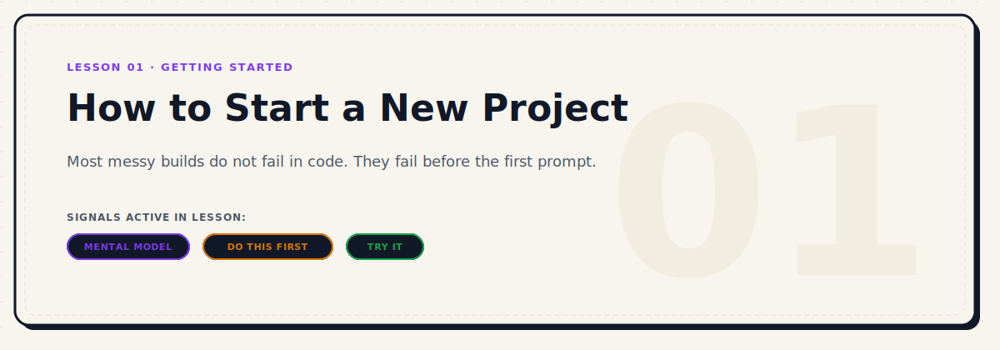

<p align="center">
  
</p>

# How to Start a New Project as a Vibe Coder

| Level | Duration | Path | Prerequisites | Tools Mentioned |
|---|---|---|---|---|
| Beginner | 8 mins | Start Here | Lesson 00 | Claude Code |

### Active Signals in this Lesson
-  ·  · 

---

## Why This Matters

Most people who start using AI coding agents start wrong.

Not wrong in an obvious way. They use the tools correctly. They write coherent prompts. They get the agent running. But something feels off after the first hour. The project gets messy. The agent starts making decisions you didn't expect. You spend time correcting instead of building.

This is not bad luck. It is a predictable outcome of starting without structure.

The way you begin a project shapes everything that comes after it. The agent inherits your setup, your context, your rules — or the absence of all three.

This lesson is about how to start a project in a way that sets you up to actually finish it.

---

## The Short Answer

The first question most people ask is: **what stack should I use?**

That is the wrong question.

The right first question is:

> **Who is my lead coding agent?**

Everything else — stack, tools, workflow — comes after that decision.

---

## The Real Mental Model


Think of a real software team. There is a lead engineer who holds the full picture of the project. They know the architecture, the decisions that were made, and why certain things were built the way they were. When something needs to get done, they either do it themselves or direct someone else.

Support engineers work on specific pieces. They do not need to know everything. They just need to understand their piece clearly.

Your multi-agent setup works the same way:

> Do not use multiple agents as a crowd.
> Use one lead agent and let the rest act like specialists.

The lead agent holds the project context. It carries the architectural memory. It makes the structural decisions. Support agents come in when you need deep code generation, a second opinion, or a different approach to a specific problem.

If you do not have a clear lead, no agent holds the full picture — and nothing ever quite fits together.

---

## Step 1: Pick Your Lead Agent


Your lead agent is the one that will hold project context across sessions. It is the one you talk to first, the one you give your `PRODUCT.md` and `RULES.md` to, and the one responsible for keeping the overall structure coherent.

Choose based on what you need from a lead:

| Agent | Best as lead when... |
|---|---|
| **Claude Code** | You need a thoughtful engineering partner who can plan, review, and execute. Good for complex projects where reasoning matters as much as code output. |
| **Codex** | You need deep code generation as the main activity. Less strong for architectural reasoning, very strong for implementation. |
| **Gemini (via Antigravity)** | You need broad reasoning and multi-perspective analysis. Good for exploration-heavy early phases. |
| **OpenCode** | You need a fast, local, privacy-friendly lead for specific contexts. |
| **Minimax** | Better used as a support agent for creative alternatives and experimentation. Not typically a lead. |

For most projects — especially product builds, full-stack work, and anything that requires ongoing architectural judgment — **Claude Code is the strongest default lead.**

---

## My real setup: Claude Code as the lead, Delegate Team as the gateway

Instead of asking multiple agents to work randomly at the same time, I establish a clear controller hierarchy. I use **Claude Code** as the lead agent, acting like a staff engineer or lead architect. Claude Code retains the primary context, reads my files, and directs the tasks.

To keep the workspace clean and avoid token waste, I give Claude Code access to [Delegate Team](https://github.com/imMamdouhaboammar/delegate-team) (`dt`). This local CLI and delegation runtime acts as a policy gateway, allowing the lead agent to dispatch specific, bounded tasks to specialized support backends (like Codex, MiniMax, Gemini, OpenCode, or VertexCoder) and team-style workflows.

The human remains the final approval layer. The delegated output is treated as untrusted until reviewed.

```txt
Human
  ↓ intent / approval
Claude Code (Lead / Controller)
  ↓ brief / review
Delegate Team (`dt`)
  ↓ controlled routing
Codex / MiniMax / Gemini / OpenCode / VertexCoder / Team mode
  ↓ result contract
Claude Code review
  ↓
Human-approved commit
```


> **AGENT MOVE:** Do not use multiple agents as a crowd. Use one lead agent and let the rest act like specialists.


> **MY MISTAKE:** The mistake is not using many agents. The mistake is using many agents without a controller, review loop, and boundaries.

---

## Step 2: Pick Your Support Agents

Support agents are not optional, but they are not always active. You bring them in when:

- The lead agent is stuck on a specific implementation
- You want a second approach to a hard problem
- You need faster iteration on a focused sub-task
- The lead's context is getting saturated

**Do not run five agents in parallel without structure.** It feels productive and produces chaos. You end up with five different answers and no way to reconcile them.

---

## Delegate Team Runtime Commands

When running with `delegate-team` (`dt`), use these CLI entries for management, validation, and execution:

```bash
# Check if dt is available
dt --help

# Check backend readiness
dt check --strict

# Focused task
dt run "fix the auth bug and run the related tests"

# Force a backend
dt run "fix the auth bug and run the related tests" --backend codex

# Large multi-module task
dt run "plan and implement the billing module with tests" --team

# Safer team workflow
dt metagpt "plan and implement the billing module with tests" --workspace-only --no-install
```

---

## When I delegate


I delegate focused tasks to support backends via `dt` in these scenarios:
- **When Claude Code is stuck** or repeating incorrect code patterns.
- **When I want a second implementation angle** or alternative algorithmic approach.
- **When the task is isolated enough** to brief clearly (e.g. self-contained helper functions, parser scripts).
- **When the task can be reviewed easily** through a simple git diff.
- **When the work can be verified** via automated test suites.
- **When a support backend is better suited** for a specific sub-task (e.g., Codex for raw boilerplate generation).
- **When I need a team-style split** using dynamic role mapping: Architect, Coder, UI Designer, and QA.

---

## When I do not delegate


I avoid delegation and handle the code directly with the lead agent (or manually) when:
- **When the task is vague** or needs active exploration/discovery.
- **When I cannot review the output** easily due to its scale or complexity.
- **When secrets, credentials, or private data** are involved in the context.
- **When the change is too broad** and impacts multiple core modules simultaneously.
- **When I need product judgment**, rather than raw code generation.
- **When the repository has no tests** or verification rules to assert correctness.
- **When the lead agent is already losing context** or drifting; adding more agents at this stage compounds the confusion.


> **DON'T BREAK:** Never let delegated output write, install, commit, delete, or change auth/cloud settings without explicit approval.

---

## A good delegation brief

A good brief prevents the support agent from making wrong assumptions. It must include:
- **Goal:** What should change and why.
- **Scope:** Target files or modules allowed to be changed.
- **Do not touch:** Files/modules strictly forbidden from modification.
- **Constraints:** Security, performance, style guidelines, or database schemas.
- **Acceptance criteria:** Concrete states that must be true.
- **Verification:** The exact tests/checks to run to verify success.
- **Expected output format:** What the final code contract looks like.

### Ready-to-use delegation prompt


```
Use Delegate Team for this focused task.

Goal:
[what should change]

Scope:
[files/modules allowed]

Do not touch:
[files/modules forbidden]

Constraints:
[security/performance/style constraints]

Acceptance criteria:
[what must be true]

Verification:
[tests/checks to run]

After delegation:
1. Inspect the result contract.
2. Review the actual diff.
3. Run the relevant tests.
4. Reject the result if it touches unrelated files or weakens security.
```

---

## Step 3: Define the Job Before the Build

Before a single line of code, answer these four questions:

1. **What am I building?**
   Not the full spec — just one clear sentence. "A tool that lets freelancers track client invoices and flag overdue payments."

2. **For whom?**
   Who uses this? What do they care about? What would make them stop using it?

3. **What does done look like?**
   What is the first version that a real person could use? Not the final vision — the first ship.

4. **What should never happen?**
   The non-negotiables. Things that, if broken, invalidate the whole product. Write these down. They become your quality gates.

---

## Step 4: Create Project Context Files

This is the structural foundation that makes your agent consistent across sessions.

Create these files before asking the agent to write any code:

### `PRODUCT.md`

What you are building, for whom, and what done looks like. The lead agent reads this at the start of every major session.

```markdown
# Product

## What it is
[One sentence description]

## Who it is for
[One sentence about the target user]

## First version
[What the first shipped version includes — and explicitly excludes]

## Non-negotiables
- [Hard constraint 1]
- [Hard constraint 2]
```

### `DESIGN.md`

Visual direction, component conventions, design decisions. If you are using a design system or specific component patterns, document them here.

### `TASKS.md`

The current task list. Updated as the project progresses. This is what the lead agent references when deciding what to work on next.

```markdown
# Tasks

## In Progress
- [ ] [Current task]

## Backlog
- [ ] [Upcoming task]

## Done
- [x] [Completed task]
```

### `RULES.md`

Behavioral rules for the agent. Things it should always do, never do, and follow without asking.

---

## Step 5: Build Your Default Stack

Your default stack is the set of tools and agents you use on every project as a baseline. It removes the decision overhead of "what should I use for this?" every time you start something new.

A strong default stack for most projects:

| Role | Tool |
|---|---|
| Lead agent | Claude Code |
| Delegation gateway | Delegate Team (`dt`) |
| Code generation support | Codex |
| Alternative reasoning | Gemini |
| Experimental / creative | Minimax |
| Code review | Open Code Review + reviewdog |
| React quality gate | React Doctor |
| Project graph | Graphify |
| Semantic navigation | Serena |

---

## Step 6: Start Small

This is where most people make the last mistake: trying to build the whole project in one session.

**Start with:**

1. **Outline** — a rough description of the architecture and main components
2. **Architecture** — the actual structure (files, folders, how it fits together)
3. **First slice** — the smallest piece that does something real
4. **Validation** — does this slice work? Is it the right foundation?
5. **Expand** — build the next piece on top of the validated foundation

---

## Step 7: Add Quality Gates Early

Quality gates are not just for production. They are for staying sane during development.

Add these before you have written significant code:

- **React Doctor** — for React codebases, catches structural and logic issues early
- **Open Code Review** — structured AI review on your changes
- **reviewdog** — pipes linter output into reviewable annotations
- **Impeccable** — if you are building any UI, gives the agent a design language to follow
- **Serena** — for semantic navigation and refactoring as the codebase grows

---

## Step 8: Know When to Switch Agents


Your lead agent is not infallible. There are clear signals that it is time to bring in a support agent or restart context:

**Switch when the lead agent:**
- Gives the same wrong answer three times in a row
- Starts contradicting earlier decisions without explanation
- Proposes a solution that is far more complex than the problem warrants
- Loses track of the file structure or starts creating files that already exist
- Produces output that no longer matches the rules you set

---

## Ship Check


Before starting any new project, confirm:

- [ ] Lead agent selected
- [ ] `PRODUCT.md` written with non-negotiables
- [ ] `RULES.md` written with at least 3 rules
- [ ] `TASKS.md` created with first task defined
- [ ] Default stack decided (even partially)
- [ ] First slice identified (not the full project)
- [ ] Quality gate decided (even one is better than none)

---

## Final Takeaway

Starting a project well is not about doing more upfront. It is about making the right decisions upfront so you do not have to undo them later.

**One lead agent. Clear rules. Small first step.**

That is the whole framework.

Everything else in this playbook builds on top of these three things.

---

*← Previous: [Step 0: Build the Project Truth](./00-step-zero-build-the-project-truth.md) | Next: [Choose Your Lead Agent →](./02-choose-your-lead-agent.md)*
