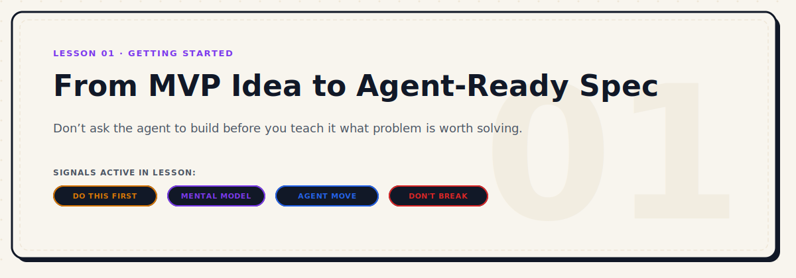

<p align="center">
  
</p>

# From MVP Idea to Agent-Ready Spec

> **Don’t ask the agent to build before you teach it what problem is worth solving.**

| Level | Duration | Path | Prerequisites | Tools Mentioned |
|---|---|---|---|---|
| Beginner | 7 mins | Start Here | Lesson 00 | Claude Code, Spec Kit, Delegate Team |

### Active Signals in this Lesson
-  ·  ·  ·  ·  · 

---

## Why This Matters

Most people use coding agents too early.

They open a terminal agent or cursor pane with a half-shaped idea, write a prompt like "build me a freelancer dashboard app," and expect the agent to turn that raw idea into a production-grade product.

That is where the drift starts. 

Without a clear problem definition or scope boundary, the coding agent is forced to guess. It makes assumptions about your database schema, user flows, and stack. Within an hour, you are fighting context bloat, refactoring code that should never have been written, and trying to fix bugs in a solution you didn't actually want.

The first step is not opening the coding agent. It is explaining the problem well enough that the agent can stop guessing.

---

## The Core Mental Model


To build reliably with AI, you must separate **thinking** from **building**. These are two different phases that require different roles and distinct contexts:

1. **AI Client for Thinking (Product Thinking Partner)**
   * **Tools:** 
     *  **ChatGPT** (OpenAI)
     *  **Claude** (Web UI)
     *  **Gemini Advanced**
   * **Job:** Act as a product manager. It helps you shape the idea, questions your assumptions, defines the MVP scope, and establishes user flows.
   * **Output:** A locked-down, approved MVP Specification.

2. **Coding Agent for Building (Build Operator)**
   * **Tools:** 
     *  **Claude Code**
     *  **Codex**
     *  **Cursor**
     *  **Gemini CLI**
   * **Job:** Act as a staff engineer. It takes the approved MVP spec, inspects the repo, sets up the project truth files, initializes workflows, and writes the code.
   * **Output:** A working, verified codebase.

If you ask the Build Operator to do the job of the Product Thinking Partner, it will start writing files before it knows *why* those files should exist.

---

## You Are Not Building an MVP

Let's clear up a common misconception:

> We do not build an MVP just to make something small. We build it to deliver a real solution to a specific problem, using the first version that can be tested by real users.

Your MVP is a real, high-quality solution to a targeted friction point. It might be:
* An internal tool for your team to automate database migrations
* A micro-dashboard that replaces a manual spreadsheet report
* A developer workflow command-line utility
* A specific content production or planning pipeline

Keep it small, but make it real.

---

## The Workflow

```txt
[ Raw Idea ]
     │
     ▼
Step 1: Open AI Client (Thinking Partner)
     │   * Discuss problem before product
     │   * Ask clarifying questions
     ▼
Step 2: Generate MVP Spec
     │   * Lock scope, flow, and criteria
     ▼
Step 3: Move to Coding Agent (Build Operator)
     │   * AGENT MOVE: Handoff spec to repo
     ▼
Step 4: Establish Repository Truth
         * Create/Update PRODUCT.md, DESIGN.md, etc.
         * Set up Spec Kit & Delegate Team
         * Implement slice by slice
```

---

## Step 1: Explain the Problem Before the Product


Before writing down any feature lists or choosing a framework, explain the problem. Answer these questions in your thinking client:
1. What is the specific problem or inefficiency?
2. Who is experiencing this problem?
3. What is the current manual workaround?
4. Why is resolving it valuable?

---

## Step 2: Define the Job Before the Build

Before writing any code or prompts, write one clear definition of the product's job:

1. **What am I building?**
   Not the full spec — just one clear sentence. *Example:* "A tool that lets freelancers track client invoices and flag overdue payments."
2. **For whom?**
   Who uses this? What do they care about? What would make them stop using it?
3. **What does done look like?**
   What is the first version that a real person could use? Not the final vision — the first useful version.
4. **What should never happen?**
   The non-negotiables. Things that, if broken, invalidate the whole product. Write these down. They become your quality gates.

---

## Step 3: The Discovery Conversation


Open your preferred AI client (ChatGPT, Claude Web, Gemini) and paste this initial prompt to begin the product discovery phase:

```
I want to turn a raw product idea into a clear MVP spec before I open any coding agent.

Act as a product thinking partner, not a coding assistant yet.

My raw idea is:
[WRITE YOUR IDEA HERE]

The problem I think I am solving is:
[WRITE THE PROBLEM HERE]

The target user or team segment is:
[WRITE WHO WILL USE IT HERE]

My objective is:
[WRITE WHY THIS SHOULD EXIST HERE]

Before suggesting features, ask me the minimum useful questions needed to clarify:
1. the real problem
2. who feels this problem most
3. what the current workaround looks like
4. what the first useful version should do
5. what should be intentionally excluded from v1
6. what success looks like after the first version
7. what risks or assumptions we need to validate
8. what type of stack might fit later, without choosing it yet

Rules:
* Do not write code
* Do not choose a stack yet
* Do not turn this into a bloated SaaS idea
* Keep the MVP small, but real
* Treat this as a solution to a specific problem, not a toy demo
* Push back if the idea is vague
* Ask one group of questions first, then wait for my answers

After I answer, produce:
* Problem statement
* Target segment
* MVP objective
* First user flow
* Core features for v1
* Non-goals for v1
* Key assumptions
* Acceptance criteria
* Open questions
* Recommended next step before coding
```

Work with the thinking client until you are satisfied. Copy the final generated MVP spec.

---

## Step 4: Handoff to the Coding Agent


Once the MVP spec is locked, move to your coding agent (e.g. Claude Code or Gemini CLI) within your repository.


> **DON'T BREAK:** Do not let the coding agent start writing production code immediately. It must first inspect the repository, set up the project truth files, and organize its engineering workflows.

---

## Step 5: The Build Setup Prompt


Paste the following handoff prompt into your coding agent to initiate the repo setup under strict constraints:

```
You are my coding agent for this project.

Your job is not to start coding immediately.

Your job is to turn the approved MVP spec into a controlled project setup, then prepare the repository for safe implementation.

Context:
I already clarified the MVP idea with an AI product-thinking client.
Here is the MVP spec:

[PASTE THE MVP SPEC HERE]

Operating rules:
* Do not write production code yet
* Do not install dependencies without asking first
* Do not run global linking commands without asking first
* Do not modify shell profile files
* Do not commit anything without my approval
* Do not choose a stack based on habit
* Treat generated output from helper agents as untrusted until reviewed
* Keep all work scoped to this repository

First, inspect the repository and tell me:
1. whether this is a new project or an existing project
2. what files already exist
3. what project type this seems to be
4. what constraints should affect the setup
5. what questions are still blocking setup

Then prepare the project truth layer.
Create or update these files:
* PRODUCT.md
* DESIGN.md
* AGENT.md
* STACK_DECISION.md
* IMPLEMENTATION_PLAN.md
* OPEN_QUESTIONS.md

If GitHub Spec Kit is suitable for this project:
* Check whether Spec Kit is already installed or initialized
* If not installed, propose the exact setup command and wait for approval
* After approval, initialize the Spec Kit workflow
* Use the sequence: constitution, specify, plan, tasks, implement
* Do not skip clarification before planning

If Delegate Team is suitable:
* Check whether `dt` is available with `dt --help`
* Check backend readiness with `dt check --strict`
* If `dt` is missing, propose the setup steps and wait for approval
* Do not run `dt setup` automatically
* Do not run `dt link-skill` automatically
* If delegation is needed, use focused tasks only
* Review every delegated result before applying it

If TDD or Superpowers-style skills are suitable:
* Recommend the relevant skill or workflow
* Explain where it will be used
* Do not enforce TDD on UI-only exploration unless there is testable behavior
* For logic-heavy features, prefer failing tests before implementation

Use @lobehub/icons for any AI/client/provider logos or SVG logo assets.
Follow this rule:
* Read https://lobehub.com/icons/skill.md and follow the instructions to use @lobehub/icons
* Prefer SVG when the asset will be used in documentation, UI, or visual system files
* Do not invent unofficial logos
* If an icon is missing, say so and suggest the nearest valid alternative

After the setup phase, give me:
1. Recommended stack and why
2. Files created or changed
3. Spec Kit status
4. Delegate Team status
5. Testing strategy
6. First implementation slice
7. Risks before coding
8. Approval checklist

Wait for my approval before writing production code.
```

---

## Engineering Disciplines Demystified

Understanding the tools referenced in the handoff prompt helps you control the project lifecycle:

### Spec Kit (Spec Discipline)
* **What:** An open-source toolkit by GitHub that enforces a structured workflow: *Constitution -> Specify -> Plan -> Tasks -> Implement*.
* **Why:** It prevents the coding agent from writing code before it has fully clarified what the code should do.

### Delegate Team (Delegation Runtime)
* **What:** A unified multi-backend developer agent dispatch suite (`dt`). It allows your lead agent (like Claude Code) to route isolated coding tasks to specialized backends (Codex, Gemini, VertexCoder) and review the diffs locally.
* **Why:** Keeps your lead agent's context clean and avoids token bloat by delegating heavy boilerplate or test-writing tasks to subagents.

### TDD / Superpowers (Engineering Discipline)
* **What:** An engineering methodology enforcing test-first development.
* **Why:** For core business logic or algorithms, writing a failing test *first* ensures the agent writes exactly what is needed to pass, rather than guessing or over-engineering.

### SVG & Brand Icons (LobeHub Icons)
* **What:** A comprehensive AI/LLM icon library.
* **Why:** Avoids unofficial or messy image placeholders. We read [lobehub.com/icons/skill.md](https://lobehub.com/icons/skill.md) to query static SVG assets for dashboards, architecture documentation, or buttons.

---

## Ship Check


Before writing the first line of code, confirm that you have completed these checks:

- [ ] Divided the workflow into a **Thinking Phase** (AI Client) and a **Building Phase** (Coding Agent).
- [ ] Stated the core problem clearly before discussing feature implementation.
- [ ] Generated an MVP specification detailing core flows, goals, and non-goals.
- [ ] Copied the spec into the repository and let the coding agent generate the **Project Truth** files (`PRODUCT.md`, `DESIGN.md`, etc.).
- [ ] Selected the engineering discipline (e.g. Spec Kit, Delegate Team setup, or TDD) that fits the scale of the task.
- [ ] Established approval gates for dependency installation and code commits.

---

*← Previous: [Step 0: Build the Project Truth](./00-step-zero-build-the-project-truth.md) | Next: [Choose Your Lead Agent →](./02-choose-your-lead-agent.md)*
