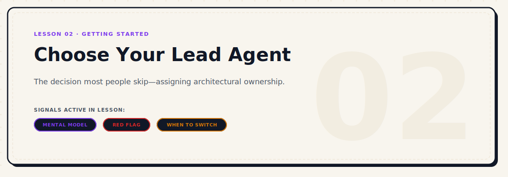

<p align="center">
  
</p>

# Choose Your Lead Agent

| Level | Duration | Path | Prerequisites | Tools Mentioned |
|---|---|---|---|---|
| Beginner | 8 mins | Start Here | Lesson 01 | Claude Code, Cursor, Copilot, Delegate Team |

### Active Signals in this Lesson
-  ·  ·  ·  ·  · 

---

## Why This Matters

This is the decision that most builders skip — and it is the one that shapes everything.

Most people open an agent and start describing what they want to build. They do not ask: *is this agent the right one to hold this project?* They just start. And when something goes wrong — wrong architecture decisions, inconsistent output, context drift — they blame the tool instead of the setup.

The lead agent is not just where you type your prompts. It is the entity that holds the architectural memory of your project, makes structural decisions, and determines how coherent the codebase stays over time.

Choosing the wrong lead is recoverable. But it costs time.

---

## What a Lead Agent Actually Is

A lead agent is the coding agent you trust to:

1. **Hold project context** across sessions and conversations
2. **Make architectural decisions** when multiple approaches are valid
3. **Keep structure consistent** as the codebase grows
4. **Direct or delegate to support agents** when needed
5. **Catch its own mistakes** before they compound

It is the difference between a contractor who shows up, builds what they are told, and leaves — and an engineer who understands the project, asks the right questions, and flags problems before they become expensive.


> The lead agent is your staff engineer. It holds the whole picture. Support agents are specialists — they are good at specific things, but they do not hold the full context and should not try to.

---

## Why Context Continuity Matters

Every agent has a context window. That window is not infinite. And across sessions — unless you explicitly re-anchor the agent — it does not remember what it decided three days ago.

The lead agent is the one you maintain context for. You do this by:

- Feeding it the same context files at the start of each session (`PRODUCT.md`, `RULES.md`, `TASKS.md`)
- Keeping those files updated as the project evolves
- Explicitly summarizing state when switching between major tasks

When you use multiple agents without a lead, no agent holds full context. Each one makes decisions based on incomplete information. The code base reflects that — inconsistent patterns, different naming conventions, structural decisions that contradict each other.

---

## How to Choose

The right lead agent depends on what you need from a lead — not what each agent is generally best at.

| Agent | Lead when... | Not ideal as lead when... |
|---|---|---|
| **Claude Code** | You need planning + reasoning + execution. Complex projects where the *why* matters as much as the *how*. | You are doing extremely deep, narrow code generation and need raw output speed above all else. |
| **Codex** | Your primary need is fast, deep code generation with minimal architectural reasoning. | The project requires cross-file architectural judgment or complex refactoring over time. |
| **Gemini** | You are in an exploration phase and want broad reasoning, multiple perspectives, and analysis before committing. | You need a consistent architectural voice across a long project. |
| **OpenCode** | You want a local, fast, privacy-respecting lead for specific contexts or environments. | You need a lead with strong planning and review capabilities. |

**For most builders, most of the time: Claude Code is the default lead.**

It combines planning, reasoning, code generation, review, and self-correction in a way that holds up over long projects.

---

## The Signal That Your Lead Is Losing the Plot


These are the signs that your lead agent has lost coherence and needs a reset — or a switch:

**Context signals:**
- Refers to files or variables that do not exist in the current codebase
- Makes decisions that contradict earlier decisions without acknowledging it
- Starts creating duplicate files or functions

**Quality signals:**
- Produces output that clearly ignores the rules you defined
- Keeps repeating the same mistake after you have corrected it twice
- Proposes solutions that are more complex than the problem requires

**Drift signals:**
- Stops asking clarifying questions when it should
- Confidently answers things it should not be confident about
- The last three outputs needed significant correction

---

## When to Keep Going vs. When to Switch


**Keep going if:**
- The agent is making small, correctable mistakes
- The output is directionally right but needs polish
- The agent responds well when you point out errors
- The context is still mostly intact

**Switch if:**
- You have corrected the same error three times and it keeps happening
- The agent's architectural understanding of the project is clearly broken
- The session has gone so long that context is saturated and degraded
- You need a genuinely different approach, not just better execution of the same one

**When you switch:**

Do not paste the whole conversation into a new agent.

Instead:
1. Update `TASKS.md` to reflect current state
2. Write a brief note about what the previous agent got stuck on
3. Open the new agent and give it the context files
4. Describe the specific problem you need help with

This is cleaner than trying to transfer a degraded conversation and faster than starting from scratch.

---

## My Setup


Here is the actual setup I use for most projects:

```
Lead:      Claude Code
Support 1: Codex         → deep code generation, alternative implementations
Support 2: Minimax       → creative alternatives, experimental approaches
Support 3: Gemini        → second reasoning angle, broad analysis
Support 4: OpenCode      → specific local tasks, fast focused requests
```

I also use a custom skill that helps Claude Code coordinate with other agents — so when Claude identifies a task that would benefit from a different tool, it can delegate that task cleanly and bring the output back into context.

The key principle: **Claude Code always holds the architectural view.** Other agents work on specific pieces and their output comes back through Claude for integration.

---

## Multi-Agent Delegation Workflow

When your project grows, running a single agent can lead to token saturation and slow execution. This is where a controller-delegation hierarchy pays off.

### My Setup: Lead Controller & Support Specialist Gateway

Instead of asking multiple agents to work randomly at the same time, establish a clear controller hierarchy. Use **Claude Code** as the lead agent, acting like a staff engineer or lead architect. Claude Code retains the primary context, reads files, and directs tasks.

To keep the workspace clean, give Claude Code access to [Delegate Team](https://github.com/imMamdouhaboammar/delegate-team) (`dt`). This local CLI and delegation runtime acts as a policy gateway, allowing the lead agent to dispatch specific, bounded tasks to specialized support backends (like Codex, MiniMax, Gemini, or OpenCode).

```txt
Human
  ↓ intent / approval
Claude Code (Lead / Controller)
  ↓ brief / review
Delegate Team (`dt`)
  ↓ controlled routing
Codex / MiniMax / Gemini / OpenCode / VertexCoder / Team mode
  ↓ result contract
Claude Code review
  ↓
Human-approved commit
```

### Delegate Team Runtime Commands

When running with `delegate-team` (`dt`), use these CLI entries for management, validation, and execution:

```bash
# Check if dt is available
dt --help

# Check backend readiness
dt check --strict

# Focused task
dt run "fix the auth bug and run the related tests"

# Force a backend
dt run "fix the auth bug and run the related tests" --backend codex

# Large multi-module task
dt run "plan and implement the billing module with tests" --team

# Safer team workflow
dt metagpt "plan and implement the billing module with tests" --workspace-only --no-install
```

---

## When to Delegate


Delegate focused tasks to support backends via `dt` in these scenarios:
- **When Claude Code is stuck** or repeating incorrect code patterns.
- **When you want a second implementation angle** or alternative algorithmic approach.
- **When the task is isolated enough** to brief clearly (e.g. self-contained helper functions, parser scripts).
- **When the task can be reviewed easily** through a simple git diff.
- **When the work can be verified** via automated test suites.
- **When a support backend is better suited** for a specific sub-task (e.g., Codex for raw boilerplate generation).
- **When you need a team-style split** using dynamic role mapping: Architect, Coder, UI Designer, and QA.

---

## When Not to Delegate


Avoid delegation and handle the code directly with the lead agent (or manually) when:
- **When the task is vague** or needs active exploration/discovery.
- **When you cannot review the output** easily due to its scale or complexity.
- **When secrets, credentials, or private data** are involved in the context.
- **When the change is too broad** and impacts multiple core modules simultaneously.
- **When you need product judgment**, rather than raw code generation.
- **When the repository has no tests** or verification rules to assert correctness.
- **When the lead agent is already losing context** or drifting; adding more agents at this stage compounds the confusion.


> **DON'T BREAK:** Never let delegated output write, install, commit, delete, or change auth/cloud settings without explicit approval.

---

## A Good Delegation Brief

A good brief prevents the support agent from making wrong assumptions. It must include:
- **Goal:** What should change and why.
- **Scope:** Target files or modules allowed to be changed.
- **Do not touch:** Files/modules strictly forbidden from modification.
- **Constraints:** Security, performance, style guidelines, or database schemas.
- **Acceptance criteria:** Concrete states that must be true.
- **Verification:** The exact tests/checks to run to verify success.
- **Expected output format:** What the final code contract looks like.

### Ready-to-use delegation prompt


```
Use Delegate Team for this focused task.

Goal:
[what should change]

Scope:
[files/modules allowed]

Do not touch:
[files/modules forbidden]

Constraints:
[security/performance/style constraints]

Acceptance criteria:
[what must be true]

Verification:
[tests/checks to run]

After delegation:
1. Inspect the result contract.
2. Review the actual diff.
3. Run the relevant tests.
4. Reject the result if it touches unrelated files or weakens security.
```

---

## Try It


Before your next project:

1. Write down the type of project you are building (product, tool, experiment, etc.)
2. Use the table above to identify which agent fits best as your lead
3. Write one sentence describing the agent's role for this project
4. Save that in your `PRODUCT.md` under a "Lead Agent" section

That sentence will anchor every session.

---

## Ship Check


- [ ] Lead agent chosen and documented in `PRODUCT.md`
- [ ] Role of each support agent defined (even loosely)
- [ ] Context files ready to feed to the lead at session start
- [ ] Know the three signals that will tell you it is time to switch

<p align="center">
  <a href="./01-turn-your-mvp-idea-into-an-agent-ready-spec.md">
    
  </a>
  <a href="./README.md">
    
  </a>
  <a href="./03-build-your-default-stack.md">
    
  </a>
</p>
