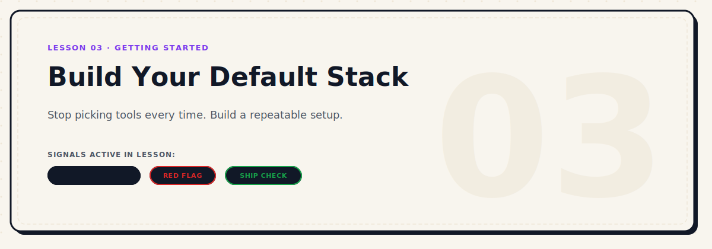

<p align="center">
  
</p>

# Build Your Default Stack

| Level | Duration | Path | Prerequisites | Tools Mentioned |
|---|---|---|---|---|
| Beginner | 5 mins | Start Here | Lesson 02 | Claude Code, Cursor, RTK, Serena |

### Active Signals in this Lesson
-  ·  · 

---

## Why This Matters

Every time you start a new project, you face a version of the same question: what tools should I use?

If you answer it from scratch every time, you are burning decision energy on something that does not need to be decided repeatedly. You also end up with inconsistent setups — projects where you used one review tool, others where you used nothing, codebases where the quality gates differ depending on how much energy you had that day.

A default stack solves this. It is your baseline configuration — the tools and agents you use on every project unless you have a specific reason not to.

It removes the question. You just start.

---

## What a Default Stack Is

A default stack is not a rigid specification. It is a starting configuration that you evolve over time.

It answers:
- Who is my lead agent?
- Which support agents do I bring in and when?
- What code review tools do I run before trusting output?
- What quality gates do I run before shipping?
- What tools help agents navigate and understand the codebase?

Once you have answers to these questions, starting a new project is faster, more consistent, and less mentally expensive.

---

## A Strong Default Stack to Start With


This is a practical starting configuration that works well across most project types:

### Agents

| Role | Agent | When to use |
|---|---|---|
| Lead | **Claude Code** | Every session. Holds context and architecture. |
| Code generation | **Codex** | Deep implementation, alternative code approaches |
| Creative / experimental | **Minimax** | When you want a very different take on a problem |
| Broad reasoning | **Gemini** | Second opinion, analysis, exploration |
| Local / fast | **OpenCode** | Specific focused tasks, privacy-sensitive contexts |

### Code Review

| Tool | Purpose |
|---|---|
| **Open Code Review** | Structured AI review on diffs and full-file scans |
| **reviewdog** | Linter output turned into reviewable annotations in CI |

### Quality Gates

| Tool | Purpose |
|---|---|
| **React Doctor** | Catches React issues: state, effects, perf, a11y, security |
| **Impeccable** | Design quality gate for any UI work |

### Project Intelligence

| Tool | Purpose |
|---|---|
| **Graphify** | Turns the repo into a queryable graph for agent context |
| **Serena** | Semantic navigation and editing for agents in real codebases |

---

## Adding Quality Gates Early

Quality gates are not just for production. They are for staying sane during development. If you wait until you are ready to ship to configure linters, formatters, and AI reviewers, you will spend your final hours correcting hundreds of styling and logic errors.

Add these gates before you have written significant code:
- **React Doctor** — for React codebases, catches structural and hook logic issues early.
- **Open Code Review** — structured AI review on your local git diffs before staging.
- **reviewdog** — pipes linter and check outputs into inline reviewable comments.
- **Impeccable** — provides the agent with the design system visual boundaries to prevent UI styling drift.
- **Serena** — enables semantic navigation so the agent doesn't get lost in deep file hierarchies.

---

## How to Customize It

The stack above is not prescriptive. It is a starting point.

Customize based on:

- **Project type** — a CLI tool needs different tools than a React app
- **Team size** — solo builders and teams have different review needs
- **Language** — some tools are language-specific
- **Phase** — early exploration needs different tools than production hardening

**The rule:** only change the default when you have a clear reason. Otherwise, keep it consistent and let it compound over time.

---

## Document Your Stack

Your tech stack choices are officially recorded and justified in `STACK_DECISION.md` as part of the Initial Truth Layer (see [Project Truth Layer Standard](../design-system/project-truth-layer.md)).

Optionally, you can create a `STACK.md` file in the project root to serve as a short operational summary of your active local configuration. If you use `STACK.md`, it must not replace `STACK_DECISION.md`, and it should link back to `STACK_DECISION.md` for architectural context.

Here is a template for the operational `STACK.md` file:

```markdown
# Stack

## Lead Agent
Claude Code

## Support Agents
- Codex — deep code generation and alternative implementations
- Gemini — broad reasoning and second opinions

## Code Review
- Open Code Review — structural AI review on diffs
- reviewdog — linter annotations in CI

## Quality Gates
- React Doctor — React quality audit before merges
- Impeccable — UI design quality check

## Project Intelligence
- Graphify — repo as queryable graph
- Serena — semantic navigation for Claude Code

## Notes
[Anything project-specific]
```

This file is also useful to give to the lead agent at the start of sessions so it knows what tools are available and can suggest or use them.

---

## The Anti-Pattern


The most common mistake with stacks is building the stack instead of the product.

Signs you are doing this:
- You spent more than a day configuring tools before writing any code
- You keep evaluating new tools instead of using the ones you have
- Your `STACK_DECISION.md` is longer than your `PRODUCT.md`
- The stack changes every project

The stack should take one hour to set up. Then you use it. The refinements come from actual use, not from research.

---

## Ship Check


- [ ] Lead agent chosen
- [ ] At least one support agent identified
- [ ] At least one code review tool configured
- [ ] At least one quality gate chosen
- [ ] `STACK_DECISION.md` written and saved in the project (and optionally `STACK.md` summarized)

---

*← Back to [Getting Started](./README.md) | Next: [Set Rules Before You Build →](./04-set-rules-before-you-build.md)*
