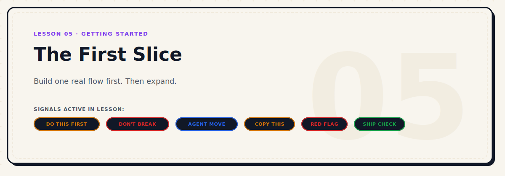

<p align="center">
  
</p>

# The First Slice: Don't Ask the Agent to Build the Whole App

> **Build one real flow first. Then expand.**

| Level | Duration | Path | Prerequisites | Tools Mentioned |
|---|---|---|---|---|
| Beginner | 8 mins | Start Here | Lesson 04 | Claude Code, Cursor, Codex |

### Active Signals in this Lesson
-  ·  ·  ·  ·  · 

---

## Why This Matters

You prepared the spec. You picked the stack. You wrote the rules. You built the project truth files.

Now you open the agent and say: "Okay, build the app."

This is where most projects go sideways.

Not because the spec was wrong. Not because the rules were bad. But because asking an agent to build an entire app at once is the wrong first move — even when everything else is ready.

A full-app prompt forces the agent to make hundreds of micro-decisions at once. Most of them will be invisible to you until the codebase is already large, tangled, and hard to correct.

The right first move is to build one small, real, complete flow. Then expand from there.

---

## The Mistake


Here is what actually happens when you ask the agent to build the whole app:

You send a prompt like:

> "Build the dashboard. Include authentication, a sidebar with navigation, a home page showing user stats, a settings screen, and the ability to manage team members."

The agent starts working. An hour later, you have:

- An auth system that was not designed to match your product
- A sidebar with placeholder nav items you did not ask for
- Three components that do similar things in different ways
- A database schema that the agent invented without asking
- A settings screen that has no connection to any real data
- A `TODO: implement this later` comment in fourteen files

The code looks impressive. But nothing is actually working end to end. You cannot test anything real. You do not know which parts are real and which are fake. And every wrong decision the agent made is now woven into the structure of the codebase.

This is not agent failure. It is prompt failure. The scope was too large.

---

## What Full-App Prompts Break


When you open a large scope too early, several things break at once:

**Scope drift.** The agent fills in gaps with assumptions. Each assumption is a decision you did not make — and will have to unmake later.

**Hidden bugs.** With many components being created at once, bugs get buried under new code before you can catch them.

**Fake completeness.** The project looks bigger than it is. Placeholder functions and mock data make it feel like progress when nothing real works yet.

**Loss of review leverage.** You cannot review output you cannot run. If nothing in the project works end to end, you have no way to test whether the agent's choices were correct.

**Context collapse.** Once a codebase becomes large in a single session, the agent loses track of its own earlier decisions. It starts contradicting itself across files.

---

## What a First Slice Actually Means

A first slice is the smallest end-to-end flow that proves the project is working correctly.

It is not:
- A home page with nice styling
- A project setup with folders and boilerplate
- A list of components that have no connection to each other

It is:
- One user action that starts somewhere and completes somewhere else
- At least one real data input or output
- Something you can actually run and verify

The slice has to be vertical — meaning it touches every layer the real feature will eventually touch. It cannot be purely frontend or purely backend. It has to go all the way through, even if the path is narrow.

Think of it as a working proof of direction, not a working product.

---

## First Slice vs Setup vs Feature

It helps to know what you are not building:

| Type | What it is | What it is not |
|---|---|---|
| **Setup** | Installing dependencies, creating folders, writing config | A working flow — nothing is connected yet |
| **Feature** | One complete piece of functionality, tested and polished | Not a good first step — too much assumes the slice exists |
| **First Slice** | The smallest real end-to-end flow | Not a full feature — intentionally narrow |

Setup comes first. The first slice comes second. Features come after the slice is solid.

If your setup feels like progress, remember: setup is just preparation. The first slice is the first moment anything actually works.

---

## How to Choose the First Slice

The best first slice is the one flow that, if it works, proves the whole product direction is correct.

Ask yourself: **What is the one thing this product has to do? What is the smallest version of that thing?**

Some concrete examples:

**Dashboard product:**
First slice → login (even if mocked) → land on dashboard → see one real or clearly-mocked data card → click one action that does something visible

**Content planner:**
First slice → create a new idea → save it → see it appear in a list → click to edit it

**CLI tool:**
First slice → run one command → get real, correct output → see a clear error message if input is wrong

**API product:**
First slice → send one request → receive the right response → see it fail correctly with a bad request

Notice that none of these are full features. None of them include settings, onboarding, admin panels, or analytics. They are just the core flow — narrow but real.

---

## Copy This


Use this prompt to ask the agent to define the first slice before building anything:

```
Before building the full app, help me define the first implementation slice.

Use the approved MVP spec and project truth files.

Do not build the whole project yet.

I want one small, real, testable flow that proves the project direction is correct.

Give me:

1. The smallest useful user flow
2. The exact screens or commands needed
3. The files likely to be created or changed
4. What should be real in this slice
5. What can stay mocked temporarily
6. What must not be built yet
7. Acceptance criteria for this slice
8. Risks if we make the slice too big
9. A step-by-step implementation plan

Rules:
- Do not add extra features
- Do not create a full dashboard unless the first slice requires it
- Do not build settings, onboarding, analytics, or admin features yet
- Do not introduce a database unless the slice truly needs it
- Prefer the simplest working path
- Stop after the first slice plan and wait for approval
```

---

## Red Flags While the Agent Is Working


Stop the agent immediately if you hear any of these:

> "I'll implement the full app structure to get started..."

> "I'll create a complete authentication system with email verification, social login, and password reset..."

> "I'll scaffold the entire folder structure so we can add features later..."

> "While I'm at it, I'll also add the settings page skeleton..."

These are signs the agent has expanded the scope without being asked. Each of these sentences represents a decision that should have been yours to make, not the agent's to assume.

The right response is to stop the agent, acknowledge what it has done, and redirect it to the first slice definition you agreed on.

---

## How to Review the Slice Before Expanding

Once the agent says the first slice is done, do not immediately ask it to continue. Stop and verify.

Ask yourself:

1. Can I actually run this? Does the flow work end to end?
2. Does it match the acceptance criteria we agreed on?
3. Is anything in here that should not be in the first slice?
4. Are there any mocked pieces I assumed would be real?
5. Does the code structure make sense to me, or is it already confusing?
6. Am I confident about the direction this is taking the codebase?

Only after you can answer yes to all of these should you tell the agent to continue to the next slice.

---

## Ship Check


Before telling the agent to expand beyond the first slice:

- [ ] The first slice runs end to end without errors
- [ ] At least one real data input or output is present (not all mocked)
- [ ] The acceptance criteria defined before building are all met
- [ ] No extra features crept in that were not part of the slice
- [ ] The folder and file structure makes sense and is easy to navigate
- [ ] You have manually run the flow yourself, not just read the code
- [ ] You can explain to someone else what the slice does in two sentences

If any box is unchecked, do not continue. Fix the slice first.

---

## After the First Slice

Once the slice passes the ship check, you have something real. From here, you expand in controlled steps — one slice at a time.

Each new slice should:
- Build on top of the previous one
- Not require rewriting what already works
- Have its own acceptance criteria before the agent starts

The first slice is not the end. It is the proof that the start was right.

<p align="center">
  <a href="./04-set-rules-before-you-build.md">
    
  </a>
  <a href="./README.md">
    
  </a>
</p>
