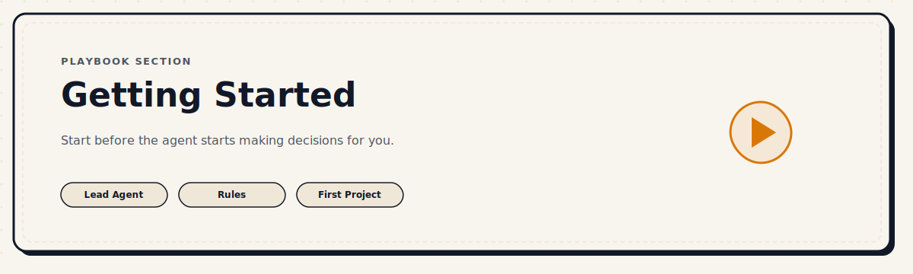

  

# Getting Started

**The entry point to the playbook.**

If you are new to working with AI coding agents, start here. Read these lessons in order before anything else in the playbook.

---

## Lessons in This Section

| # | Lesson | What you will learn |
|---|---|---|
| 0 | [Step 0: Build the Project Truth](./00-step-zero-build-the-project-truth.md) | Build the project truth layer (PRODUCT.md, DESIGN.md, etc.) before writing code |
| 1 | [From MVP Idea to Agent-Ready Spec](./01-turn-your-mvp-idea-into-an-agent-ready-spec.md) | Shape your concept with an AI thinking client first, then hand it off to a coding agent |
| 2 | [Choose Your Lead Agent](./02-choose-your-lead-agent.md) | The most important decision most builders skip |
| 3 | [Build Your Default Stack](./03-build-your-default-stack.md) | Stop picking tools every time. Build a repeatable setup — including a runtime safety layer for React apps. |
| 4 | [Set Rules Before You Build](./04-set-rules-before-you-build.md) | How rules make agents predictable instead of unpredictable |
| 5 | [The First Slice](./05-the-first-slice.md) | Build one real end-to-end flow before expanding. Never ask the agent to build the whole app at once. |

---

## Why This Section Exists

Most people who start using coding agents make the same foundational mistakes:

1. They start building too early, before defining what the project truth is (Lesson 0)
2. They ask the agent to build before teaching it what problem is worth solving (Lesson 1)
3. They open an agent and immediately start describing what to build — without selecting a lead agent (Lesson 2)
4. They pick a stack based on habit rather than product needs (Lesson 0 & 3)
5. They skip writing rules and spend time correcting the same behavior in every session (Lesson 4)
6. They ask the agent to build the entire app at once — and lose control of the codebase immediately (Lesson 5)

These six lessons address each of those directly.

---

*← Back to [Playbook Home](../README.md)*
