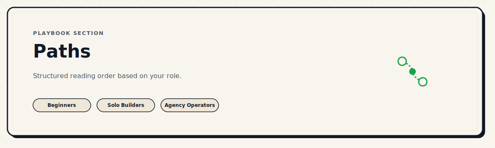

  

# Paths

**Not everyone starts from the same place. Find yours.**

A path is a structured reading order through the playbook, based on where you are, what you are building, and what you need right now.

## Not sure which path fits?

Start with the [Path Finder](./path-finder.md). It maps common problems, roles, and workflow bottlenecks to the best first resource and next step.

---

## Available Paths

| Path | Best for |
|---|---|
| [Path Finder](./path-finder.md) | Choosing a route from your current problem instead of guessing from path names |
| [Fresh Vibe Coder Path](./fresh-vibe-coder-path.md) | Going from point 0 to 10 by building a real project through clean, structured prompts |
| [Beginner Path](./beginner-path.md) | First time using a coding agent of any kind |
| [Solo Builder Path](./solo-builder-path.md) | Building products alone with AI assistance |
| [Frontend Path](./frontend-path.md) | UI-first builders focused on design and interfaces |
| [Product-Minded Path](./product-minded-path.md) | Product thinkers who want to build with more precision |
| [Agency Operator Path](./agency-operator-path.md) | Running multiple clients or projects simultaneously |

---

## How to Use a Path

1. Pick the path that fits your current situation, not your aspirations.
2. Read the listed lessons in the suggested order.
3. Apply each lesson to a real project before collecting more resources.
4. Come back to the Path Finder when your main bottleneck changes.

Paths are not permanent tracks. You can move between them whenever your situation changes.

---

*Back to [Playbook Home](../README.md).*